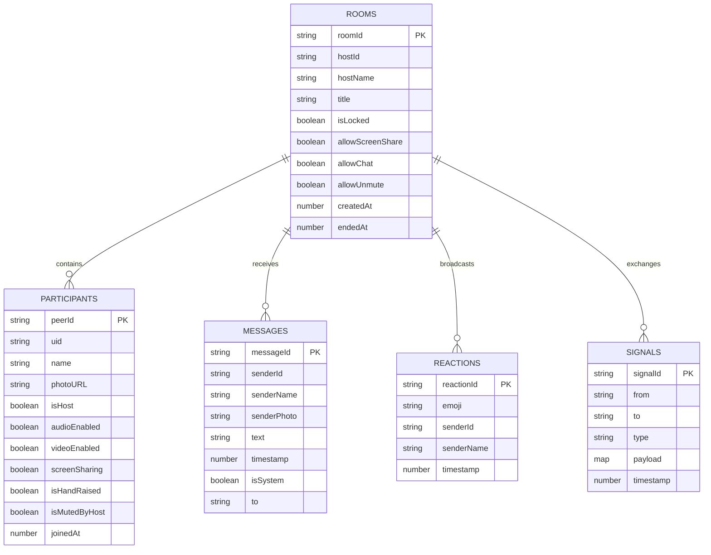

# Database & Real-Time State Architecture — Sabha (सभा)
**Document:** `docs/DATABASE.md`  
**Status:** Approved | **Version:** 1.0.0  

---

## 1. Overview & Database Choice

Sabha is designed for **100% serverless, zero-maintenance state persistence**. Instead of hosting a dedicated PostgreSQL or MongoDB instance, Sabha uses **Google Cloud Firestore** (under the Firebase Spark Free Plan) for its real-time document synchronization, combined with ephemeral client-side state.

### Why Firestore for Sabha?
- **Real-Time WebSockets (`onSnapshot`):** Sub-100ms multi-peer document sync without hosting or scaling socket servers.
- **Generous Free Tier:** 50,000 document reads, 20,000 document writes, and 20,000 document deletes every day for $0.00.
- **Client SDK Direct Access:** Native browser SDK handling offline reconnects and automatic indexing.

---

## 2. Firestore Entity-Relationship Diagram (ERD)



---

## 3. Detailed Collection Schemas

### 3.1 Collection: `rooms`
- **Document ID:** `{roomId}` (e.g. `meet-xyz-789`)
- **Lifecycle:** Created when host initializes the room; updated on setting toggles; marked with `endedAt` on conclusion.

| Field Name | Type | Nullable | Description |
| :--- | :--- | :--- | :--- |
| `roomId` | `string` | No | Unique room code/identifier |
| `hostId` | `string` | No | ID of the room creator |
| `hostName` | `string` | No | Name of the room creator |
| `title` | `string` | No | Meeting title |
| `isLocked` | `boolean`| No | Prevents new users from joining |
| `allowScreenShare`| `boolean`| No | Host permission toggle |
| `allowChat` | `boolean`| No | Host permission toggle |
| `allowUnmute` | `boolean`| No | Host permission toggle |
| `createdAt` | `number` | No | Epoch timestamp in milliseconds |
| `endedAt` | `number` | Yes | Epoch timestamp when host ends meeting |

### 3.2 Sub-Collection: `rooms/{roomId}/participants`
- **Document ID:** `{peerId}` (e.g. `peer_abc123`)
- **Lifecycle:** Written upon joining the green room; deleted or flagged when leaving.

| Field Name | Type | Nullable | Description |
| :--- | :--- | :--- | :--- |
| `id` | `string` | No | Peer identifier matching document ID |
| `uid` | `string` | No | Firebase Auth UID or guest ID |
| `name` | `string` | No | Display name |
| `photoURL` | `string` | Yes | User avatar URL |
| `isHost` | `boolean`| No | Host admin privileges flag |
| `audioEnabled` | `boolean`| No | Microphone mute state |
| `videoEnabled` | `boolean`| No | Camera track state |
| `screenSharing`| `boolean`| No | Whether currently sharing screen |
| `isHandRaised` | `boolean`| No | In hand-raise queue |
| `isMutedByHost`| `boolean`| No | Host forced-mute state |
| `joinedAt` | `number` | No | Epoch timestamp in milliseconds |

### 3.3 Sub-Collection: `rooms/{roomId}/messages`
- **Document ID:** Auto-generated Firestore ID
- **Lifecycle:** Appended when user sends message; sorted by `timestamp ascending`.

| Field Name | Type | Nullable | Description |
| :--- | :--- | :--- | :--- |
| `id` | `string` | No | Message document ID |
| `senderId` | `string` | No | Sender participant peer ID |
| `senderName` | `string` | No | Sender display name |
| `senderPhoto`| `string` | Yes | Sender avatar URL |
| `text` | `string` | No | Text content (max 2000 chars) |
| `timestamp` | `number` | No | Unix timestamp |
| `isSystem` | `boolean`| Yes | True if auto-generated announcement |
| `to` | `string` | Yes | `'everyone'` or recipient peerId for DM |

### 3.4 Sub-Collection: `rooms/{roomId}/signals`
- **Document ID:** Auto-generated Firestore ID
- **Lifecycle:** Transient signaling messages (SDP offers/answers, ICE candidates, mute commands). Cleaned up post-meeting.

---

## 4. Firestore Security Rules

To ensure privacy between rooms, the following Firestore Security Rules are recommended:

```javascript
rules_version = '2';
service cloud.firestore {
  match /databases/{database}/documents {
    
    // Room Settings Rules
    match /rooms/{roomId} {
      allow read: if true;
      allow create: if request.auth != null || request.resource.data.roomId != null;
      allow update: if request.auth != null || resource.data.hostId == request.resource.data.hostId;
      
      // Participants Rules
      match /participants/{participantId} {
        allow read: if true;
        allow write: if true; // In guest mode or authenticated
      }

      // Messages Rules
      match /messages/{messageId} {
        allow read: if true;
        allow create: if request.resource.data.text.size() > 0 && request.resource.data.text.size() <= 2000;
      }

      // Reactions Rules
      match /reactions/{reactionId} {
        allow read, create: if true;
      }

      // Signals Rules
      match /signals/{signalId} {
        allow read, write: if true;
      }
    }
  }
}
```

---

## 5. Storage Quotas & Cleanup Strategy

| Metric | Spark Free Tier Limit | Sabha Daily Usage (Est. 50 calls) | Headroom |
| :--- | :--- | :--- | :--- |
| **Reads / day** | 50,000 | ~8,000 – 12,000 reads | >75% buffer |
| **Writes / day** | 20,000 | ~2,500 – 4,000 writes | >80% buffer |
| **Bandwidth** | 10 GB / month | ~500 MB (Signaling data only) | >95% buffer |
