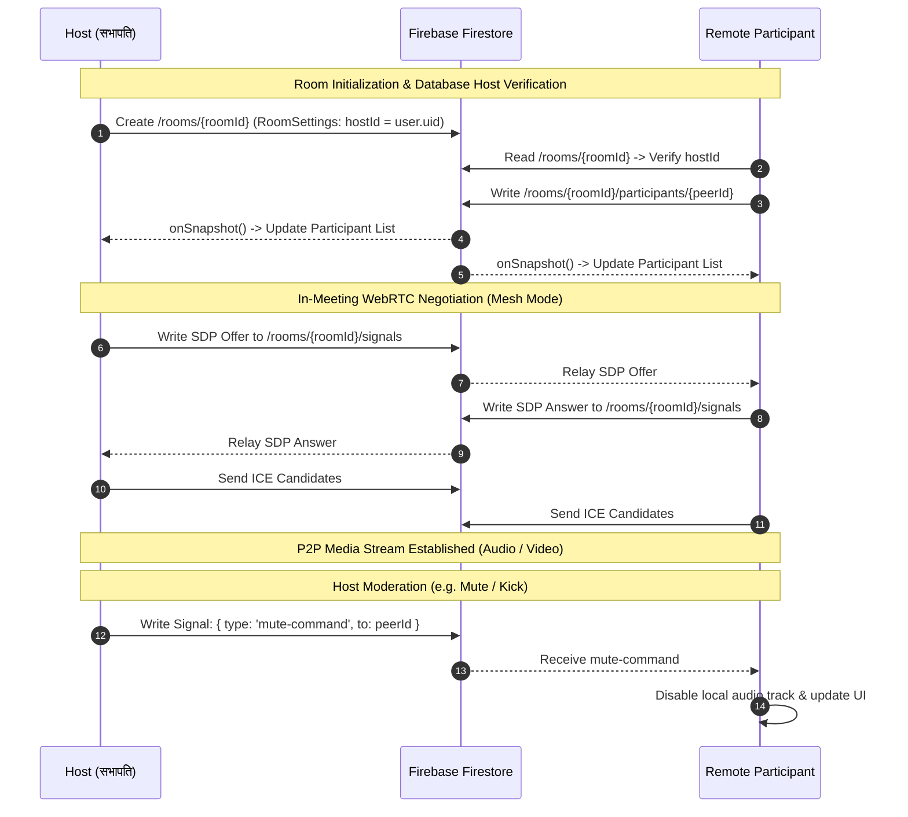

# System Architecture & Technical Specification — Sabha (सभा)
**Document:** `docs/SYSTEM_ARCHITECTURE.md`  
**Status:** Approved | **Version:** 1.0.0  

---

## 1. High-Level System Architecture

Sabha is architected around a **Dual-Tier Real-Time Topology** designed for maximum resilience, low latency, and zero fixed cloud infrastructure costs.

```
+-----------------------------------------------------------------------------------+
|                                  CLIENT LAYER                                     |
|                                                                                   |
|  +-----------------------------------------------------------------------------+  |
|  |                           Next.js 16 Client App                             |  |
|  |   +---------------+   +-------------------+   +-------------------------+   |  |
|  |   |   GreenRoom   |-->|    MeetingRoom    |<--|    MeetingControls HUD  |   |  |
|  |   +---------------+   +-------------------+   +-------------------------+   |  |
|  |           |                     |                         |                 |  |
|  |           v                     v                         v                 |  |
|  |   +---------------+   +-------------------+   +-------------------------+   |  |
|  |   | Web Audio API |   |  VideoGrid (CSS)  |   | Whiteboard (HTML Canvas)|   |  |
|  |   | (Speaker Det.)|   | (1-12 Responsive) |   |  & MediaRecorder (WebM) |   |  |
|  |   +---------------+   +-------------------+   +-------------------------+   |  |
|  +-----------------------------------------------------------------------------+  |
|                                     |                                             |
|                                     v                                             |
|                    +--------------------------------+                             |
|                    |     Media Manager Selector     |                             |
|                    +--------------------------------+                             |
|                               /          \                                        |
|               (If Cloud SFU  /            \ (If Mesh Fallback                    |
|                Configured)  /              \ Configured / Dev)                    |
+----------------------------/----------------\-------------------------------------+
                            /                  \
                           v                    v
+-----------------------------+       +---------------------------------------------+
|     LIVEKIT SFU CLOUD       |       |           NATIVE WEBRTC MESH ENGINE         |
|  (Selective Forwarding)     |       |                                             |
|  - Ingests 1 local stream   |       |  - Direct PeerConnection per participant    |
|  - Fan-out to N peers       |       |  - Google STUN (stun.l.google.com:19302)    |
|  - Dynacast & Adaptive res  |       |  - Full mesh topology (N*(N-1)/2 connections)|
|  - Supports 50-100+ users   |       |  - BroadcastChannel (Intra-tab zero lag)    |
+-----------------------------+       +---------------------------------------------+
               ^                                             ^
               |                                             |
               | (JWT Auth)                                  | (SDP / ICE Signaling)
               v                                             v
+-----------------------------+       +---------------------------------------------+
|    VERCEL SERVERLESS API    |       |              FIREBASE SERVICES              |
|                             |       |                                             |
|  - GET /api/livekit-token   |       |  - Firebase Google Authentication           |
|    (Signs JWT tokens with   |       |  - Cloud Firestore Real-Time Storage:       |
|     API Secret & Grants)    |       |    - /rooms/{roomId}/signals                |
|  - POST /api/auth/record-   |       |    - /rooms/{roomId}/messages (Chat)        |
|    login (IP & User-Agent)  |       |    - /rooms/{roomId}/reactions (Reactions)   |
|                             |       |    - /users/{uid}/loginHistory (Audit Log)  |
+-----------------------------+       +---------------------------------------------+
```

---

## 2. Component Subsystems

### 2.1 Media Manager Selector & Hardware Handling
At meeting initialization inside [`MeetingRoom.tsx`](file:///components/meeting/MeetingRoom.tsx):
1. **Hardware Release in Lobby:** Prior to entering the room, [`GreenRoom.tsx`](file:///components/meeting/GreenRoom.tsx) explicitly terminates all preview media stream tracks (`stream.getTracks().forEach(t => t.stop())`). This immediately releases mobile Android (Camera2 / AudioRecord HAL) and desktop OS hardware handles, eliminating `NotReadableError: device in use` conflicts.
2. The client requests a LiveKit token from `/api/livekit-token?room={roomId}&username={peerId}&isHost={isHost}`.
3. **If LiveKit responds with valid JWT and WebSocket URL:**
   - Server-side and client-side sanitization strips accidental whitespace/tab characters (`\t`) from environment variables (`LIVEKIT_URL`).
   - Instantiates [`LiveKitRoomManager`](file:///lib/livekitService.ts) with `adaptiveStream: false, dynacast: false` to ensure SFU never throttles custom `<video>` elements without element attachment observers.
   - Local webcam and microphone tracks are published via native `setCameraEnabled` and `setMicrophoneEnabled`.
   - In-call mute/unmute toggles execute cleanly via native room manager controls without hardware re-acquisition latency.
   - Video elements in [`VideoTile.tsx`](file:///components/meeting/VideoTile.tsx) maintain `muted={true}` with dedicated background `<audio>` playback, bypassing strict mobile (Android Brave/iOS Safari) unmuted autoplay restrictions.
   - Incoming stream updates emit fresh `MediaStream` references (`new MediaStream(stream.getTracks())`) so React re-render cycles bind video feeds instantly.
   - Screen sharing tracks (`Track.Source.ScreenShare`) are segregated into dedicated streams (`onRemoteScreenStreamAdded` / `onRemoteScreenStreamRemoved`), preventing camera streams from colliding with presentations.
4. **If LiveKit returns an error or is unconfigured:**
   - Falls back gracefully to [`WebRTCManager`](file:///lib/webrtc.ts).
   - Initializes direct peer-to-peer `RTCPeerConnection` instances between all room participants.
   - Re-packages incoming audio and video tracks onto fresh `MediaStream` objects to trigger reliable rendering on track addition.
   - SDP offers/answers and ICE candidates are relayed through Firestore sub-collections or local `BroadcastChannel`.

### 2.2 Spotlight Presentation Stage & Screen Sharing Architecture
Active screen sharing transitions `VideoGrid.tsx` into a presentation-centric layout:
- **Presentation Viewport:** Renders the screen share track using CSS `object-contain` over an ultra-dark canvas, guaranteeing that code, IDE text, and slide graphics maintain native pixel sharpness without crop clipping.
- **Presenter Controls & Fullscreen:** Displays live presenter status ("You are sharing your screen" / "[User] is presenting"), an integrated "Stop Sharing" button, and fullscreen request controls.
- **Participant Filmstrip:** Maintains participant webcam video tiles and active speaker indicators in an ergonomic horizontal filmstrip below the presentation stage.
- **Auto-Cleanup:** Hooks into native browser media track `onended` events to reset room layout automatically when sharing is stopped via system-level Chrome/Edge sharing bars.

### 2.3 Signaling Protocol & State Synchronization
The signaling protocol synchronizes the state of peers, messages, and admin commands:



### 2.4 Audio Analysis Engine ([`lib/audio.ts`](file:///lib/audio.ts))
Active speaker detection runs completely client-side to minimize processing overhead:
- **Audio Context Creation:** Creates an `AudioContext` from the stream's audio tracks.
- **FFT Analysis:** Uses an `AnalyserNode` with `fftSize = 256` and `smoothingTimeConstant = 0.8`.
- **RMS Energy Calculation:** Evaluates root-mean-square amplitude every 50ms.
- **Threshold Gating:** If RMS exceeds the speaking threshold (~25–35 dB sensitivity level) consistently for >100ms, the peer is marked as active speaker, dispatching an event to apply the emerald glow ring.

---

## 3. Data Flow & Security Model

### 3.1 Data Flow Diagrams

#### A. In-Meeting Chat & Reactions
```
User Types Message -> ChatPanel.tsx 
  -> roomService.sendChatMessage() 
  -> Firestore addDoc(/rooms/{roomId}/messages)
  -> Firestore onSnapshot() triggers for all peers
  -> Appends to message history & updates unread badge
```

#### B. Local Session Recording
```
MeetingControls.tsx (Toggle Record)
  -> navigator.mediaDevices.getDisplayMedia({ video: true, audio: true })
  -> MediaRecorder(stream, { mimeType: 'video/webm; codecs=vp9,opus' })
  -> ondataavailable -> chunks.push(event.data)
  -> onstop -> Blob([chunks]) -> URL.createObjectURL(blob)
  -> Auto-triggers <a> download as 'sabha-meeting-{date}.webm'
```

### 3.2 Security Matrix
| Boundary | Mechanism | Implementation |
| :--- | :--- | :--- |
| **LiveKit Auth** | HMAC-SHA256 JWT | Generated exclusively server-side via `livekit-server-sdk` with expiration |
| **Firebase Auth** | Google OAuth & Firebase Anonymous | Verified via `firebase/auth` and session tokens |
| **Firestore Security** | Declarative Rules | Locked collections per `roomId`; participants can only modify their own presence doc |
| **WebRTC Media** | DTLS-SRTP Encryption | Mandatory encrypted media transport natively enforced by browser WebRTC engines |
| **Local Recordings** | Zero-Knowledge Local Storage | Media never touches a remote server; captured and saved purely client-side |

---

## 4. Scalability, Limits & Trade-Offs

### 4.1 Topology Comparison
| Parameter | Full-Mesh Fallback | LiveKit SFU Cloud |
| :--- | :--- | :--- |
| **Peer Overhead** | Uploads stream to each peer ($N-1$) | Uploads 1 stream to server ($1$) |
| **Bandwidth (Upload)** | $O(N)$ — High for $N > 6$ | $O(1)$ — Extremely Low |
| **Bandwidth (Download)** | $O(N)$ | $O(N)$ with Dynacast bitrate adaptation |
| **Max Practical Room Size** | 4–6 participants (HD), 8–10 (Audio) | 50–100+ participants |
| **Infrastructure Cost** | **$0.00 / month** | Free tier (50GB/mo) -> Pay-as-you-go |
