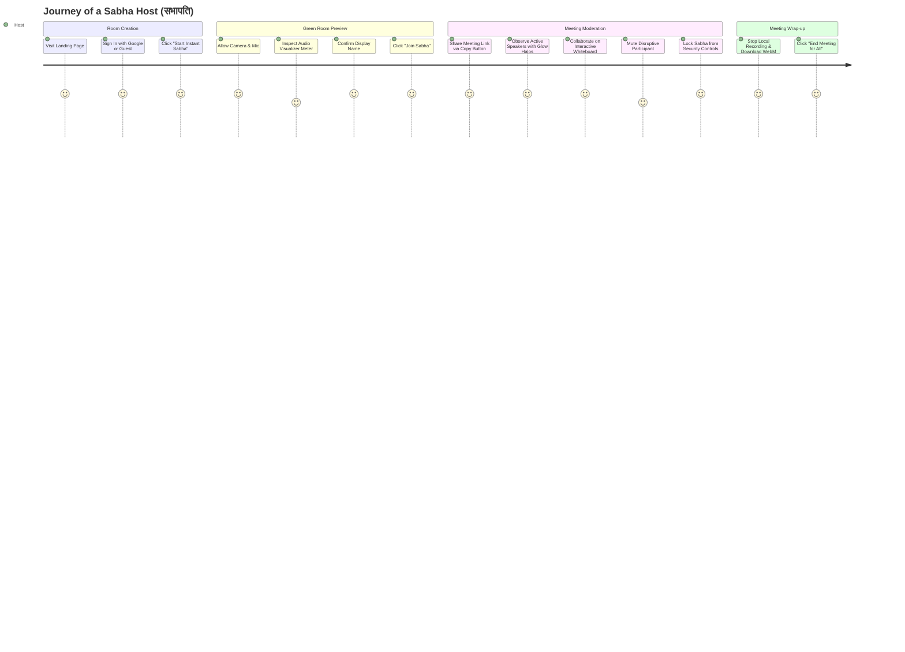
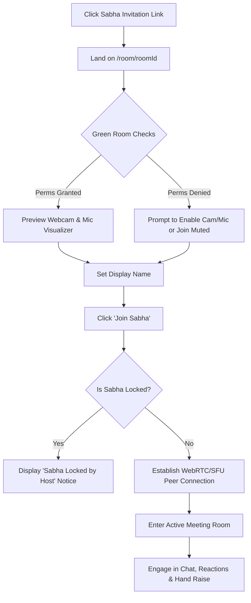

# End-to-End User Journeys & Flows — Sabha (सभा)
**Document:** `docs/USER_JOURNEY.md`  
**Status:** Approved | **Version:** 1.0.0  

---

## 1. Journey 1: Host Initiates & Leads a Sabha Assembly



### Detailed Flow Steps:
1. **Landing & Authentication:** Host visits the root URL (`/`). They can authenticate with Google for a profile avatar or click "Start Instant Sabha" directly.
2. **Green Room Check:** The browser asks for camera and microphone permissions. A mirrored video preview renders immediately, alongside an audio volume bar powered by the Web Audio API.
3. **Entering the Room:** Host enters the meeting at `/room/{roomId}?host=true`. Host status is stamped on their participant record in Firestore.
4. **Collaboration & Control:**
   - Host clicks the **Copy Link** button in the top navigation bar to invite attendees.
   - Host opens the **Host Security Modal** to toggle attendee permissions (Screen Sharing, In-Meeting Chat, Unmute Rights) or lock the room.
   - Host triggers **Screen Share** to present slides with system audio.
   - Host opens the **Whiteboard Modal** to draw architectural diagrams, then exports the canvas to PNG.
5. **Session Wrap-Up:** Host stops the recording; the browser prompts an immediate local file download for `sabha-meeting-[timestamp].webm`.

---

## 2. Journey 2: Attendee Joins via Meeting Link



### Key Attendee Touchpoints:
- **Zero Friction Entry:** No software installation, no app store redirect, and no mandatory registration.
- **Privacy First:** Attendee can join with camera or mic muted directly from the Green Room.
- **Orderly Participation:** Attendee can click the **Raise Hand** button; their tile in the video grid displays a yellow hand indicator, notifying the host.
- **Micro-Interactions:** Attendee triggers floating emoji reactions (🎉, 👏, ❤️) which burst onto the screen and trigger confetti for celebratory moments.

---

## 3. Journey 3: Real-Time Problem Escalation & Resolution

```
[Problem] Background noise from participant's environment disrupts the discussion.
   │
   ├─► Step 1: Active Speaker detection highlights the noisy tile with green ring.
   ├─► Step 2: Host opens the Participants Panel (👥).
   ├─► Step 3: Host clicks "Mute" next to the noisy participant's name.
   ├─► Step 4: A `mute-command` signal is dispatched via Firestore / BroadcastChannel.
   ├─► Step 5: Target client's audio track is disabled instantly; UI notifies them.
   └─► Resolution: Meeting proceeds smoothly with zero interruption.
```
